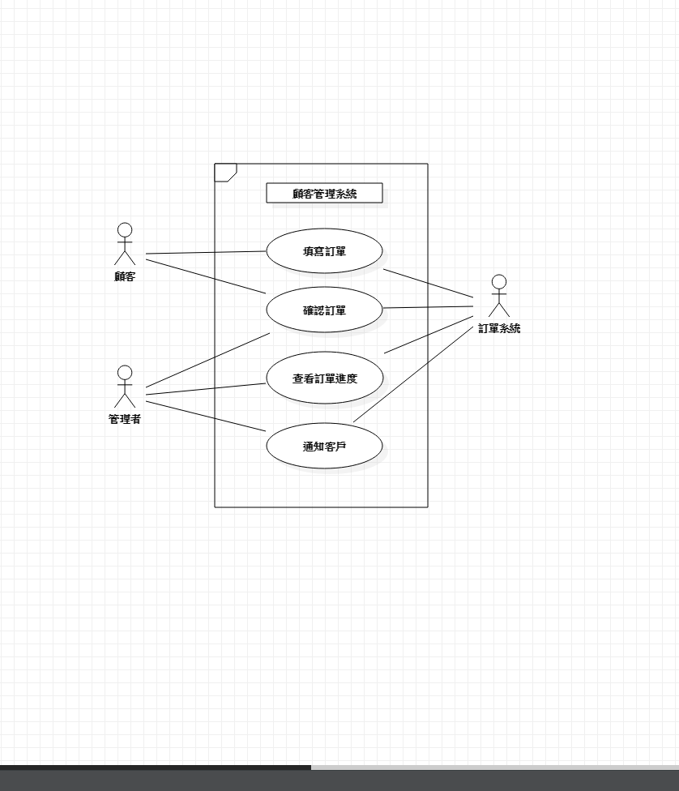

# 訂單管理系統
## 查看客戶訂單.客戶資料及退換貨服務
### 功能性需求:
    1.客戶填寫訂單
    2.管理者確認訂單,開始製作產品
    3.產品製作完成,通知客戶取貨
### 非功能性需求:
    1.只有管理者可以管理客戶訂單
    2.客戶確認之後即無法更改訂單樣式及數量
    3.每15分鐘更新訂單資訊

### 使用案例的重要性
    1.填寫訂單
    2.確認訂單
    3.查看訂單
### 使用案例
##### 訂單系統
    1.讓顧客填寫訂單
    2.通知管理者收到訂單
    3.讓管理者確認訂單
##### 管理者
    1.收到顧客訂單
    2.和顧客確認訂單
    3.開始製作
    4.產品製作完成通知顧客取貨
    5.詢問顧客售後服務
##### 顧客
    1.顧客開啟訂單系統
    2.填寫訂單並送出
    3.收到管理者已確認訂單
    4.收到取貨通知
### user story:
 我是一個管理者,希望能透過查看訂單的功能,能完成客戶的需求。
 我是一個顧客，希望能透過填寫訂單的功能，來購買自己想要的商品。
       
