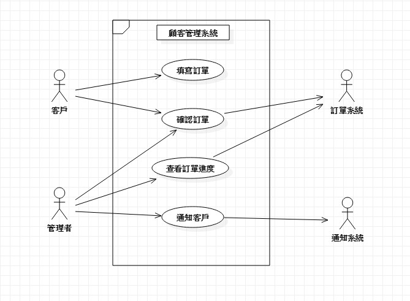

# 顧客關係管理
## 查看客戶訂單.客戶資料及退換貨服務
### 功能性需求:
    1.客戶填寫訂單
    2.管理者確認訂單,開始製作產品
    3.產品製作完成,通知客戶取貨
### 非功能性需求:
    1.只有老闆可以管理客戶訂單
    2.客戶確認之後即無法更改訂單樣式及數量

### 使用案例的重要性
    1.客戶填寫訂單
    2.管理者確認訂單
    3.開始製作產品
    3.通知客戶取貨
####    
    
