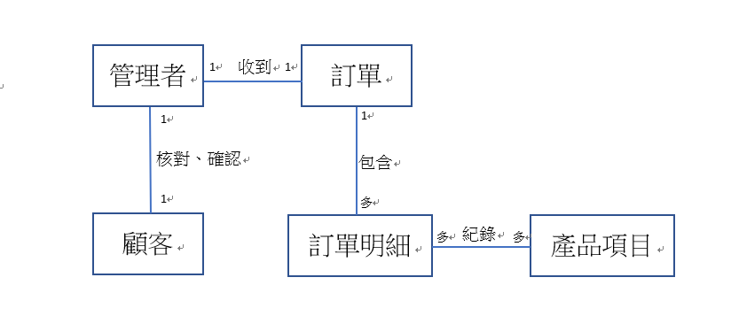

# 訂單管理系統
## 查看客戶訂單.客戶資料及退換貨服務
### 功能性需求:
    1. 客戶填寫訂單
    2. 管理者確認訂單,開始製作產品
    3. 產品製作完成,通知客戶取貨
### 非功能性需求:
    1. 只有管理者可以管理客戶訂單
    2. 客戶確認之後即無法更改訂單樣式及數量
    3. 每15分鐘更新訂單資訊

### 使用案例的重要性
    1. 填寫訂單
    2. 確認訂單
    3. 查看訂單
### 使用案例
##### 填寫訂單
    主要路徑    
    1. 顧客想要訂購商品
    2. 顧客上網填寫訂單
     2.1 開起訂單系統
     2.2 填寫基本資料
     2.3 選擇訂購商品
    3. 填寫完畢後送出    
    替代路徑    
    2.1 顧客直接以電話或mail方式訂購商品
##### 確認訂單
    主要路徑
    1. 收到顧客訂單
    2. 查看顧客訂單
     2.1 開啟訂單系統
     2.2 核對顧客訂單內容
    3. 跟顧客確認訂單
     3.1 透過訂單系統查詢顧客資料
     3.2 聯繫顧客詢問訂單是否無誤
    4. 確認後開始製作 
##### 查看訂單
    1. 管理者想要查看訂單
     1.1 開啟訂單系統
     1.2 查詢訂單    
### user story:
    我是一個管理者，希望能透過查看訂單的功能，能完成客戶的需求。
    我是一個顧客，希望能透過填寫訂單的功能，來購買自己想要的商品。 
    我是一個顧客，希望能透過確認訂單，來確認自己的訂單無誤。
### 初步類別圖
#### 填寫訂單

#### 確認訂單

#### 查看訂單

### 系統循序圖
#### 填寫訂單

#### 確認訂單

#### 查詢訂單

### 循序圖
#### 填寫訂單

#### 確認訂單

#### 查看訂單

#### 強韌圖

